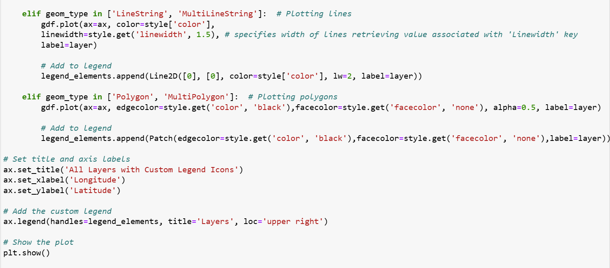

# *Advanced GIS final project - "Multiple plots"*
## **About the project**
This project is focused on developing script for plotting different layers. The major objectives include:
- Plotting all the layers from a file geodatabase (individual plots)
- Plotting all the  layers in one frame in Jupyter notebook
- Plotting all the layers in one single figure
- Plotting all the layers in one figure and changing the legend/markers in the figure

## **Results**
Script to plot the layers in one figure with different markers is presented below:

To access the full code, click below:
[**Multiple Plots Repository**](https://github.com/KarinaAnzar/GIS_Plotting.git)
