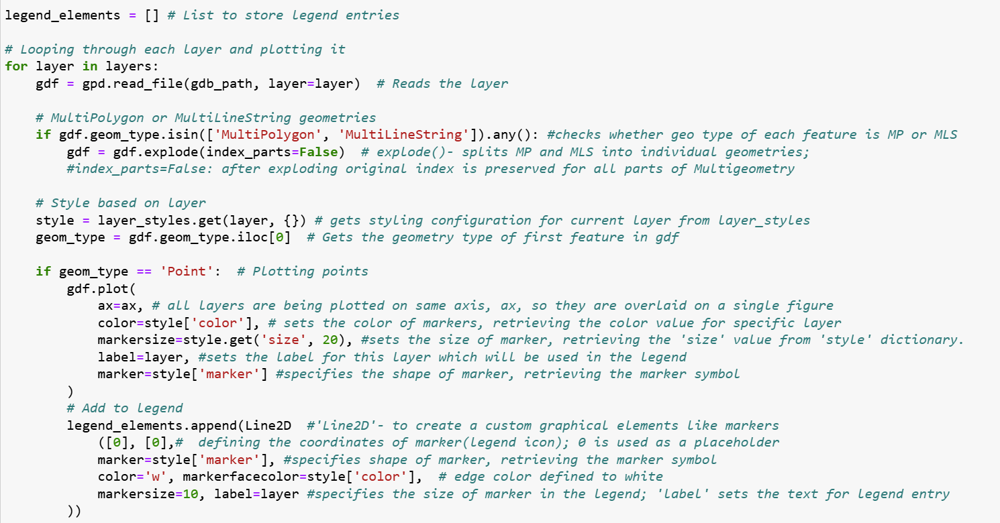

# *Advanced GIS project - "Multiple layers plotting"*
Automating the visualization of spatial layers from file Geodatabases using Python, involving 
- accessing the spatial data
- plotting layers and
- styling and customization

## **About the project**
This project focuses on developing a Python-based script for visualizing spatial data layers stored in a file geodatabase. The primary objectives include plotting of all layers individually to analyze each dataset separately and creating a consolidated view by plotting all layers in a single frame within a Jupyter Notebook. Additionally, the project aims to generate a single figure showcasing all layers together with customized legends and markers, enhancing clarity and differentiation among the layers. The script ensures flexibility in styling, enabling the use of distinct geometries, colors, and markers for various layers to create informative and visually appealing maps.

## **Objectives**
The specific tasks and objectives include:
1. **Individual Layer Visualization**: Develop a script to plot each layer from a file geodatabase separately, allowing for detailed analysis of individual datasets.
2. **Combined Layer Visualization in Jupyter Notebook**: Generate a consolidated frame displaying all layers together within a single cell in Jupyter Notebook for a unified spatial overview.
3. **Single-Figure Multi-Layer Plotting**: Create a single figure that integrates all layers, ensuring comprehensive visualization.
4. **Customized Legends and Markers**: Enhance the single-figure visualization by applying customized legends, markers, and styles for each layer, enabling clear differentiation and improved visualization.

## **Code and output maps**
An important part of the script to create a single figure integrating all layers with customized legends, markers, and styles for each layer is presented below:

To access the full code, click here:
[**Multiple Plots Repository**](https://github.com/KarinaAnzar/GIS_Plotting.git)
